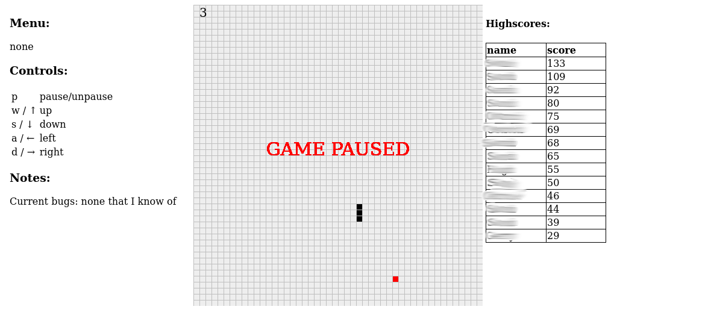

# Snake Game
>Classic snake game.

>You control a snake in four directions. Goal of the game is to eat red dots, let the snake grow and therefore increase the score. The game is over as soon as the snake bites itself. The snake can pass through the boundaries of the screen without harm and will reappear on the other side of the screen.
---
## Implementation
The game is completely done in JavaScript using an HTML canvas element. PHP is only used for writing and reading Highscores.

### Layout
- info panel on the left for showing controls, notes etc.
- main game area containing the canvas to play in. The current score is shown in the top left corner.
- highscores table
